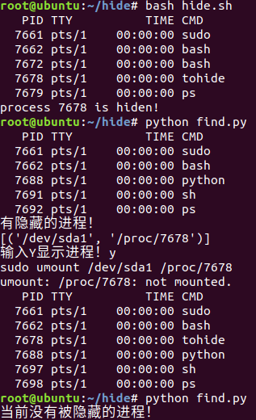

# 实现隐藏进程

## 隐藏的进程

> int main() {
>
>   while (1) {
>
> ​    sleep(1);
>
>   }
>
>   return 0;
>
> }

一个不断运行，什么都不干的进程

## 隐藏方式

需要隐藏的进程放到后台运行，用进程名搜出它的PID，使用mount方法进行隐藏。

# 隐藏进程的检测与终止

用python执行命令```cat /proc/mounts```，分析输出，找到格式对应的挂载信息，然后取消挂载，终止进程。

# 成果

