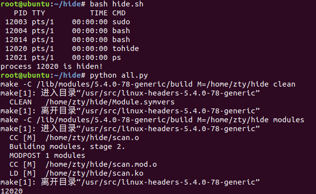

# 实现了在内核态下遍历进程

## 编写内核模块

[模块代码](scan.c)

在内核态下从init_task出发，利用task_struct结构遍历所有进程并输出。

## 用shell脚本完成模块的装卸，把dmesg输出重定向到一个文件里

[脚本](scan.sh)

感觉这里写的有些粗糙，本来想从模块直接输出到一个文件里，但会直接卡死，我还没有搞明白是哪里写错了

## 用python读取dmesg的输出，和```ps -e```的输出进行比对，找出劫持内核函数、用户态隐藏的进程

[python代码](all.py)

## 现在的效果



不是很看得出和之前的区别，因为我没有实现复杂的隐藏手段……


## 还有一份代码是只能用于检验用户态隐藏进程的

[比对/proc目录和ps命令输出](scan.py)