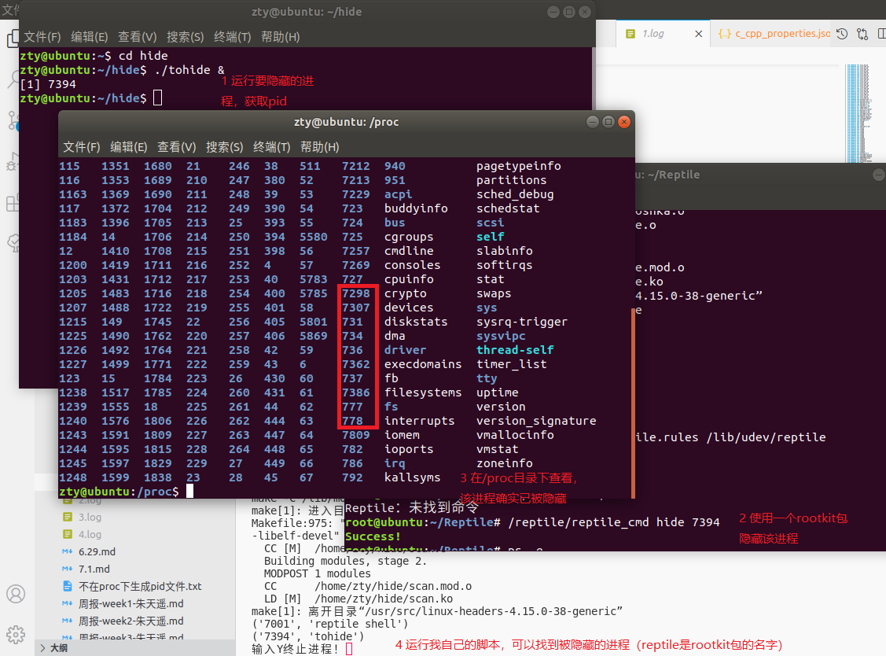

# 隐藏进程

找到了一个rootkit工具包[Reptile](https://github.com/f0rb1dd3n/Reptile)，可以在4.15.0-38-generic内核上隐藏进程。

隐藏原理是黑入一些函数，（copy_creds, exit_creds（进程文件的创建与销毁）, audit_alloc（命令审计）, find_task_by_vpid（查找进程）, vfs_statx（VFS虚拟文件系统）, sys_kill（kill命令））在系统显示、查找、杀死（存疑，这个包里的确hook了sys_kill函数，但我试了一下，可以正常终结被隐藏的进程，不会如代码中写的一样报“没有那个进程”）进程。

使用这个包测试我的检测工具，证实该工具可以检测出内核态隐藏的进程。

# 遍历进程

我遍历进程使用的是list_for_each函数，这是Linux内核里双向链表结构的一个函数，不是专为进程管理系统设计的，如果被黑会有不可估量的连锁反应，所以可以认为是安全的。

入口使用Linux的初始进程init_task的tasks（进程链表头），这与Linux调度进程执行是同一个变量，在这里隐藏会导致进程根本不执行，因此这里一定是安全的。

因此，整个遍历的方法是没有问题的。

# 误差

目前能想到两种可能的误差情况。

1. 如老师所说，在两次检测之间生成/死亡的进程

解决方案如下：

检测时分为四个步骤：用户态读取`ps -e`输出->内核态遍历进程->比对找出隐藏的进程->误差检查

把遍历时存在而读取输出时不存在的进程认为是隐藏进程。

误差检查时，使用`ps -e | grep "进程名"`搜索，如果有结果，则确认是误差。

2. 混在内核态遍历过程中生成的进程

在内核态遍历进程涉及内核模块的编译和装卸，耗时较长，期间有可能会有进程运行。

之前我比较懒，是直接砍掉了输出末尾的4个进程（在python脚本里调用shell脚本安装内核模块需要4个进程sh, sudo, bash, insmod，是ps命令不可能有的输出）。但这个过程中可能会有kworker进程生成，被排序在这4个进程之间，直接砍掉4个的话，sh进程可能会被视作隐藏。

我优化了这里的程序，首先是把检测过程中调用脚本编译内核模块改为直接安装编译好的模块，大幅度缩减需要的时间，然后改了过滤方式，确定一定过滤掉安装模块时生成的进程。

